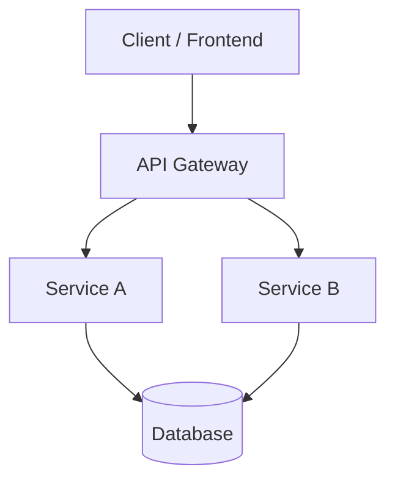

# Arsitektur Sistem

> Update file ini setiap kali ada perubahan arsitektur signifikan.
> AI (Copilot) akan membaca file ini sebagai konteks saat membantu coding.

## Overview

```
[Deskripsi singkat sistem — apa yang dibangun dan untuk siapa]
```

## Diagram Arsitektur



## Komponen Utama

| Komponen | Teknologi | Tanggung Jawab |
|----------|-----------|----------------|
| Frontend | -         | -              |
| Backend  | -         | -              |
| Database | -         | -              |
| Cache    | -         | -              |

## Data Flow

1. User melakukan request ke `[endpoint]`
2. `[Service]` memvalidasi input
3. Data diambil dari `[database/cache]`
4. Response dikembalikan dalam format `[JSON/XML]`

## Keputusan Arsitektur (ADR)

### ADR-001: [Judul Keputusan]
- **Status**: Accepted / Deprecated / Superseded
- **Konteks**: Mengapa keputusan ini perlu dibuat?
- **Keputusan**: Apa yang dipilih?
- **Konsekuensi**: Apa dampaknya?

## Batasan & Constraint

- [ ] Max request per second: `[angka]`
- [ ] Max payload size: `[ukuran]`
- [ ] SLA uptime: `[%]`
