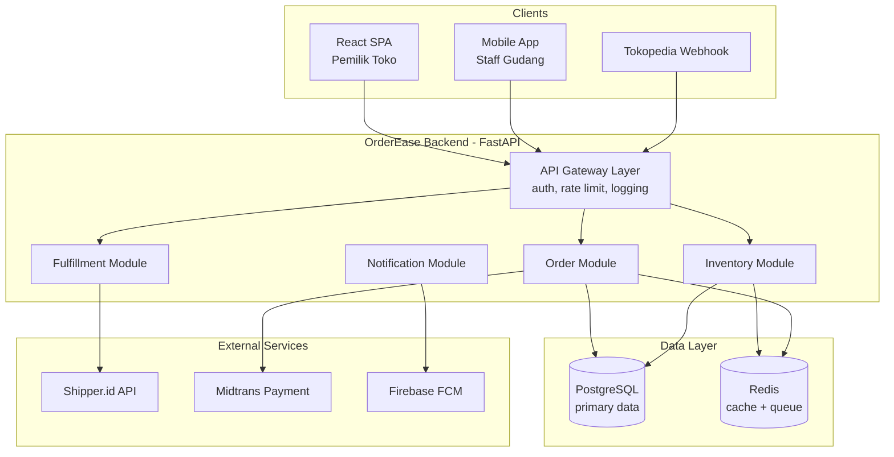

# Arsitektur Sistem — OrderEase

> Update file ini setiap kali ada perubahan arsitektur signifikan.
> AI (Copilot) akan membaca file ini sebagai konteks saat membantu coding.
> Contoh di bawah menggunakan stack Python/FastAPI + PostgreSQL + Redis.

---

## Overview

```
OrderEase adalah modular monolith (bukan microservices) berbasis FastAPI.
Satu codebase, tapi diorganisasi per domain (orders, inventory, fulfillment).
Deploy sebagai satu container Docker, scale horizontal via load balancer.
```

## Diagram Arsitektur



---

## Stack Teknologi

| Layer       | Teknologi            | Versi        | Alasan Dipilih                                             |
| ----------- | -------------------- | ------------ | ---------------------------------------------------------- |
| Backend     | Python / FastAPI     | 3.11 / 0.111 | Async native, auto OpenAPI docs, type-safe dengan Pydantic |
| ORM         | SQLAlchemy + Alembic | 2.x          | Mature, support async, migrasi terstruktur                 |
| Database    | PostgreSQL           | 15           | ACID, JSON column untuk metadata fleksibel                 |
| Cache/Queue | Redis                | 7            | Stock reservation pakai Redis atomic ops (INCR/DECR)       |
| Frontend    | React + TypeScript   | 18 / 5       | Tim sudah familiar, ekosistem luas                         |
| Auth        | JWT + Refresh Token  | -            | Stateless, cocok untuk mobile + web                        |
| Deploy      | Docker + Nginx       | -            | Simple, reproducible, mudah di-deploy di VPS               |

---

## Struktur Direktori Backend

```
app/
├── main.py                  # FastAPI app entry point
├── core/
│   ├── config.py            # Settings dari environment variable (pydantic BaseSettings)
│   ├── database.py          # SQLAlchemy async engine & session factory
│   ├── security.py          # JWT encode/decode, password hashing
│   └── dependencies.py      # FastAPI Depends: get_db, get_current_user
│
├── modules/
│   ├── orders/
│   │   ├── router.py        # FastAPI router — endpoint /orders
│   │   ├── service.py       # Business logic — OrderService
│   │   ├── repository.py    # DB queries — OrderRepository
│   │   ├── schemas.py       # Pydantic request/response models
│   │   ├── models.py        # SQLAlchemy ORM models
│   │   └── exceptions.py    # Domain exceptions: OrderNotFoundError, etc.
│   ├── inventory/
│   │   └── ...              # Struktur sama dengan orders/
│   └── fulfillment/
│       └── ...
│
└── tests/
    ├── conftest.py          # Fixtures: test db, test client, mock services
    ├── test_orders/
    └── test_inventory/
```

---

## Komponen Utama & Tanggung Jawab

| Komponen             | File                              | Tanggung Jawab                                               |
| -------------------- | --------------------------------- | ------------------------------------------------------------ |
| `OrderService`       | `modules/orders/service.py`       | Business logic: create order, confirm, cancel, apply voucher |
| `StockService`       | `modules/inventory/service.py`    | Reserve/release stok, cek ketersediaan, update dari webhook  |
| `FulfillmentService` | `modules/fulfillment/service.py`  | Booking kurir via Shipper.id, update tracking                |
| `OrderRepository`    | `modules/orders/repository.py`    | Semua query DB untuk orders — TIDAK ada business logic       |
| `RedisStockLock`     | `modules/inventory/redis_lock.py` | Atomic stock reservation pakai Redis SETNX + expire          |

---

## Data Flow: Create Order (Happy Path)

```
1. POST /orders  →  OrderRouter.create_order()
2.   → Validate payload (Pydantic schema)
3.   → get_current_user (JWT dependency)
4.   → OrderService.create_order(dto, user_id)
5.       → VoucherService.validate_and_lock(voucher_code)  [jika ada voucher]
6.       → StockService.reserve_bulk(items)                [atomic Redis + DB]
7.       → OrderRepository.create(order_data)              [insert ke PostgreSQL]
8.       → NotificationService.send_async(order_id)        [push via Redis queue]
9.   → Return OrderResponse (201 Created)
```

---

## Keputusan Arsitektur (ADR)

### ADR-001: Modular Monolith, bukan Microservices

- **Status**: Accepted
- **Konteks**: Tim terdiri dari 2 backend developer. Microservices butuh overhead infra yang tidak sebanding dengan ukuran tim.
- **Keputusan**: Modular monolith — satu codebase dengan pemisahan domain yang ketat via module boundaries.
- **Konsekuensi**: Deployment lebih simple. Trade-off: kalau traffic besar perlu refactor ke service terpisah (sudah diantisipasi dengan repository pattern).

### ADR-002: Redis untuk Stock Reservation

- **Status**: Accepted
- **Konteks**: Stock deduction di PostgreSQL rentan race condition saat order masuk bersamaan.
- **Keputusan**: Gunakan Redis `SETNX` + `EXPIRE` untuk lock stok sementara, baru commit ke PostgreSQL setelah lock berhasil.
- **Konsekuensi**: Jika Redis down, stock reservation gagal (order masuk PENDING). Ini acceptable karena lebih baik gagal daripada oversell.

### ADR-003: Harga Disimpan di OrderItem saat Order Dibuat

- **Status**: Accepted
- **Konteks**: Harga produk bisa berubah kapan saja. Laporan keuangan harus akurat.
- **Keputusan**: `OrderItem.unit_price` di-snapshot saat order dibuat, bukan foreign key ke tabel harga.
- **Konsekuensi**: Perubahan harga tidak mempengaruhi order lama. Tidak bisa aggregate "total revenue per produk berdasarkan harga saat ini".

---

## Batasan & Constraint

- Max concurrent order creation: **500 req/s** (dibatasi oleh Redis throughput)
- Max payload request: **1 MB** (Nginx config)
- SLA uptime: **99.5%** (boleh down maks ~3.6 jam/bulan)
- Database connection pool: **20 connections** per instance (PostgreSQL max_connections = 100, 5 instance max)
